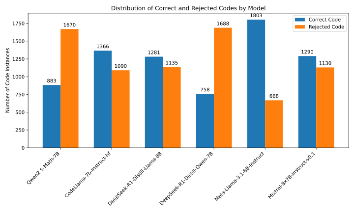
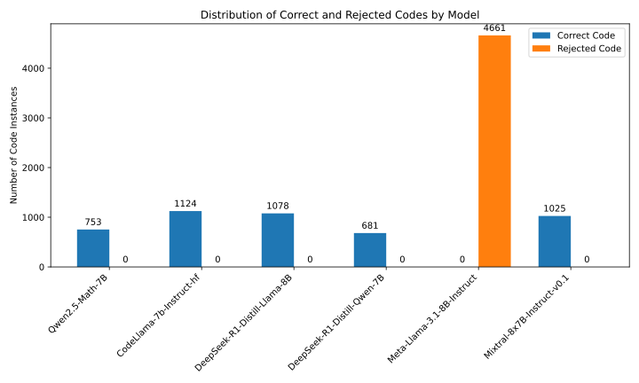
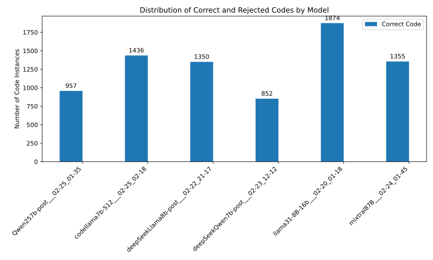

<h1 style="text-align: center;">Visual Reasoning with Code Generation</h1>

This project focuses on enhancing visual reasoning capabilities of Large Language Models (LLMs) by training them to generate code. A key component of this work is the creation of a preference and SFT dataset derived from the GQA dataset. 

---

## 📖 Overview

The primary goal was to collect a substantial amount of data to train LLMs for visual reasoning tasks. Since existing approaches like viperGPT use few-shot learning via prompt engineering, they don't allow for direct adaptation of model weights to improve code reasoning. Therefore, this project aimed to create a dataset that encapsulates diverse forms of code-based reasoning grounded on visual questions.

---

## 🛠️ 3.1 Dataset Construction Process

To generate the dataset, six different LLMs were utilized: Llama-3.1-8b, CodeLlama-7b, Mixtral-87B, DeepSeek-Llama-8b, Qwen2.5-7b, and DeepSeek-Qwen-7b.

### Generation Configuration
For all models, the recommended `generation_config.json` was adopted, with a key modification:
* **Temperature**: Set to `1`. This was done to encourage diversity in reasoning strategies. Many GQA questions are structurally similar, and without access to the image, deterministic sampling often yields identical code. A temperature of 1, while slightly reducing per-model accuracy, provides more diverse reasoning paths, which is beneficial for modeling reasoning diversity.

The generation was performed on 12,600 samples from the `train_balanced_questions.json` file of the balanced training split of the GQA dataset.

### Code Evaluation and Categorization
Once code was generated for each question, the programs were executed to obtain answers and evaluate code quality. Each outcome was categorized into one of four classes:

1.  **Correct answer**: The generated code correctly answers the visual question.
2.  **Semantic or inference error**: The code fails to produce the correct answer. This could be due to:
    * An **inference error**, where the code is logically sound, but the Vision-Language Models (VLMs) invoked during execution make incorrect inferences.
    * A **semantic error**, where the code itself lacks appropriate reasoning logic.
3.  **Runtime error**: The code runs but fails due to runtime issues. This can be caused by:
    * Errors during execution (e.g., incorrect function usage, invalid data handling).
    * A VLM failing to process input correctly (e.g., returning empty lists due to missing object detections). This latter case, though potentially an inference error, is included here for simplicity.
4.  **Syntax error**: The generated code contains syntax errors that prevent parsing or execution.

*Note*: Some edge cases, like semantically incorrect code yielding a correct result due to coincidental VLM failure, are not systematically addressed.

A system was developed to assign each evaluated program to one of these categories. These categories form a strict hierarchy, allowing for quick comparison of reasoning quality between different code pieces.

**Table 3.1: Performance of each LLM on the balanced training-question set, over 12600 instances.** GLIP-Large and BLIP2-Flan-T5-XL (32-bit) were used as the VLMs.

| LLM             | Code Error | Runtime Error | Semantic/Inference Error | Correct |
|-----------------|------------|---------------|--------------------------|---------|
| llama31-8b      | 156        | 199           | 6018                     | 6228    |
| codellama7b     | 194        | 997           | 6476                     | 4934    |
| mixtral87B      | 296        | 1646          | 5802                     | 4857    |
| deepSeekLlama8b | 1153       | 1007          | 5658                     | 4783    |
| Qwen2.5-7b      | 2090       | 1976          | 5057                     | 3478    |
| deepSeekQwen7b  | 3019       | 2026          | 4480                     | 3076    |

### Preference Hierarchy

An ideal preference hierarchy would have five distinct reasoning-quality levels:
`Correct answer > Inference error > Semantic error > Runtime error > Syntax error`

However, since an automated classifier cannot reliably distinguish inference errors from semantic errors, these two are merged in practice.

**Practical hierarchy used by the automatic classifier:**
`Correct answer > Inference / semantic error > Runtime error > Syntax error`

This strict ordering allows the construction of a preference system: for any two candidate codes for the same visual question, it's possible to decide which one demonstrates better reasoning. This procedure is similar to Reinforcement Learning from Human Feedback, but with automatic labeling. From these pairwise decisions, a dataset of preferences can be constructed, selecting pairs via a heuristic focusing on the most informative comparisons.

**Table 3.2: Distribution of the 12600 visual question instances according to the classifications of the 6 generated codes per instance.**

| Pattern | Compilation Er | Run-time Er | Sem./Inf. Er | Correct | # instances |
|---------|----------------|-------------|--------------|---------|-------------|
| A       |                |             |              | ✓       | 443         |
| B       | ✓              |             |              | ✓       | 409         |
| C       |                | ✓           |              | ✓       | 447         |
| D       |                |             | ✓            | ✓       | 375         |
| E       | ✓              | ✓           |              | ✓       | 2209        |
| F       | ✓              |             | ✓            | ✓       | 1820        |
| G       |                | ✓           | ✓            | ✓       | 1973        |
| H       | ✓              | ✓           | ✓            | ✓       | 1198        |
| I       | ✓              |             |              |         | 0           |
| J       |                | ✓           |              |         | 0           |
| K       |                |             | ✓            |         | 1           |
| L       | ✓              | ✓           |              |         | 793         |
| M       | ✓              |             | ✓            |         | 1008        |
| N       |                | ✓           | ✓            |         | 1078        |
| O       | ✓              | ✓           | ✓            |         | 846         |
| **Total** |                |             |              |         | **12600** |

*Interpretation of Table 3.2:*
* Ticks (✓) indicate at least one of the six models produced code in that category for an instance.
* E.g., category B: at least one model generated correct code, and at least one produced code with a compilation error.
* **Pattern I**: Least informative (no new knowledge).
* **Patterns J and K**: Limited use (e.g., K only teaches avoiding non-compiling code).
* **Patterns L, M, N, O**: Stronger signal; help learn to avoid run-time errors, but correct reasoning isn't explicitly reinforced.
* **Patterns B, C, D, E, F, G, H**: Strongest learning signal; include at least one correct code and at least one lower-hierarchy code, encouraging correct output and discouraging incorrect solutions.
* **Pattern A**: Contains a correct code and no incorrect alternatives; suitable for supervised-fine-tuning (SFT), not preference comparisons.

Across the dataset, 8,874 out of 12,600 visual questions have at least one correct answer, implying an upper-bound accuracy of approximately $8874/12600 \approx 0.7$ if all six models' knowledge could be consolidated. It's an open question whether this can be surpassed if the model generalizes transferred knowledge.

---

## 📊 3.2 Preferences Dataset

To build the preference dataset, only the 8,431 instances falling into patterns B–H were retained.

### Approach 1: Single-Pair Dataset
* Randomly selects two codes for each instance: one correct (preferred) and one incorrect (rejected, from a lower-hierarchy category).
* Contains 8,431 pairwise comparisons.
* **Splits**: 1,000 instances for development (validation), remainder for training. This division is random and used as the validation set for all training runs, affecting other dataset constructions to prevent contamination.

### Approach 2: Every-Pair Dataset
* Selects *all* code pairs where one code is correct and the other is incorrect.
* After discarding the 1,000 development set visual questions (amounting to 7,112 code pairs), the final dataset has 52,487 training pairs (from an original 59,599).
* This dataset is considerably larger, though many codes might be more similar to each other.

### Approach 3: Llama-Specific Dataset
* Figures 3.3 and 3.5 show `llama31-8b` has the highest number of preferred codes and lowest rejected ones.
* This motivated a third dataset tailored to enhance `llama31-8b`'s performance.
* Contains only codes that `llama31-8b` generated incorrectly. The aim is to discourage past mistakes while integrating knowledge from other models.
* **Construction**:
    1.  Filter out the 1,000 development set visual questions.
    2.  Select remaining visual questions where `llama31-8b` produced incorrect code.
    3.  For each selected instance, create all possible preference pairs:
        * **Rejected code**: The incorrect code from `llama31-8b`.
        * **Preferred code**: A correct code generated by *another* model for the same visual question.
* This resulted in a dataset of 4,661 pairs for training `llama31-8b`.

---

## 3.3 SFT Dataset (Supervised Fine-Tuning)

* Built using the 8,874 instances from patterns A–H (those with at least one correct code).
* For each instance, a random correct code is selected.
* Creates a dataset of 8,874 instances.
* **Validation**: 1,000 instances are reserved for a validation dataset – specifically, the same set of queries used for the preference dataset's development set.

